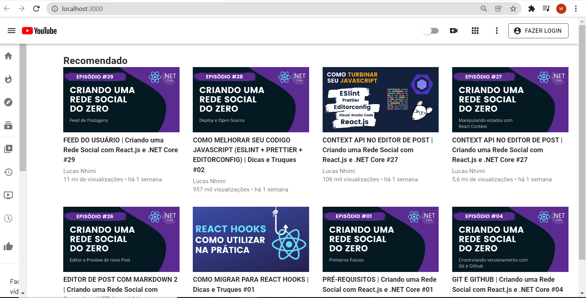
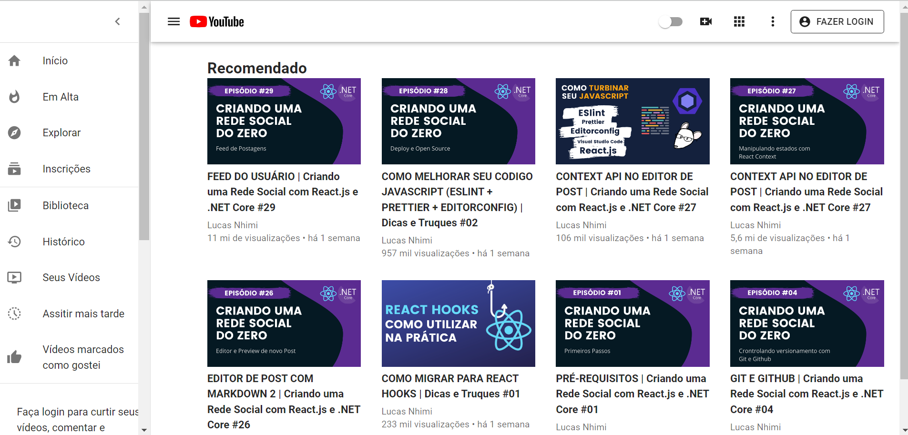

### Clone-Interface-YouTube

## Comands Used

1. `npx create-react-app client`

[Comandos abaixo pego no site do Material UI](https://mui.com/pt/getting-started/installation/)
Lembrete: Certifique-se de adicionar as fonts no html como link que o material ui pede na docs.

2. `npm install @mui/material @mui/styled-engine-sc styled-components`

3. `npm install @mui/material @emotion/react @emotion/styled` 

4. `npm install @mui/icons-material`

5. `npm install @material-ui/core`

## A aplicação ficou responsiva para todos os tamanhos de tela (Ainda há alguns pequenos ajustes, também inserir um botão a mais com troca de tema escuro e claro apenas para exercitar)

<h1 align='center'>Main Screen</h1>

 

<h1 align='center'>Menu <h4>(Ficou um pouco diferente do original)</h4></h1>

 

